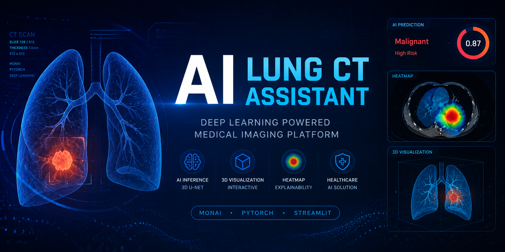

<p align="center">

  

</p>
# 🫁 AI Lung CT Assistant

Deep Learning Powered Medical Imaging Platform

---

## 📌 Project Overview

AI Lung CT Assistant is a deep learning based medical imaging system built with:

- PyTorch
- MONAI
- Streamlit

This project demonstrates:

- 3D CT image analysis
- Medical AI inference
- AI heatmap visualization
- Lesion overlay visualization
- Interactive CT slice viewer

---

## 🚀 Live Demo

Streamlit Cloud Deployment:

[Open AI Lung CT Assistant](https://lung-ct-ai-demo.streamlit.app/)
---

## 🖼 Demo Screenshot


---

## ✨ Features

- 3D Medical Image Processing
- AI CT Scan Analysis
- Interactive CT Slice Viewer
- AI Attention Heatmap
- Lesion Overlay Visualization
- Streamlit Web Interface
- MONAI Medical Imaging Pipeline

---

## 🏗 Tech Stack

| Category | Technology |
|---|---|
| Deep Learning | PyTorch |
| Medical Imaging | MONAI |
| Web App | Streamlit |
| Visualization | Matplotlib |
| Medical Data | NIfTI (.nii.gz) |

---

## 🧠 Model Architecture

This project uses:

- 3D U-Net
- MONAI framework
- Medical CT preprocessing pipeline

---

## 📂 Project Structure

```bash
lung_ct_ai/
│
├── app/
│   └── demo_app.py
│
├── models/
│   └── lung_nodule_classifier.pth
│
├── screenshots/
│   └── ct_prediction_demo.png
│
├── requirements.txt
│
└── README.md
```

---

## ⚙️ Installation

Clone the repository:

```bash
git clone https://github.com/Edison-Cao/lung_ct_ai.git
```

Install dependencies:

```bash
pip install -r requirements.txt
```

Run Streamlit app:

```bash
streamlit run app/demo_app.py
```

---

## 📊 AI Workflow

CT Scan Upload

→ Medical Image Preprocessing

→ MONAI Transform Pipeline

→ 3D U-Net Inference

→ AI Heatmap Generation

→ Lesion Overlay Visualization

→ Risk Prediction

---

## 🔮 Future Improvements

- Grad-CAM Visualization
- DICOM Support
- AI Report Generation
- Docker Deployment
- HuggingFace Deployment
- Multi-model Fusion

---

## ⚠️ Disclaimer

This project is for educational and research purposes only.

It is NOT intended for clinical diagnosis.

---

## 👨‍💻 Author

Edison Cao

AI Healthcare / Medical Imaging / Deep Learning