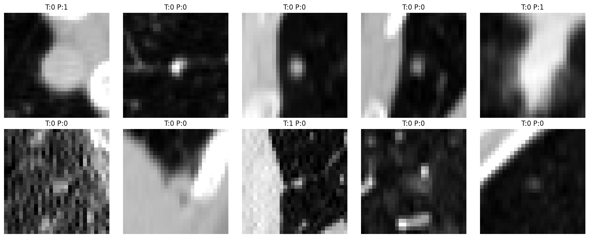

# AI-Powered Lung CT Analysis Platform Based on MONAI

## Project Overview

This project is a 3D medical imaging AI system for lung CT analysis.

Built with:

- Python
- PyTorch
- MONAI
- MedMNIST3D

The model can:

- Analyze 3D CT scans
- Detect lung nodules
- Perform AI-based classification
- Visualize CT slices

---

## Tech Stack

- Python
- PyTorch
- MONAI
- Streamlit
- NumPy
- Matplotlib

---

## Model Performance

Current Accuracy:

84.84%

---

## Features

- 3D CNN model
- Medical image classification
- CT visualization
- AI inference pipeline

---

## Demo Screenshot

---

## Future Improvements

- MONAI segmentation
- Real NIfTI CT support
- AI report generation
- LLM integration
- Cloud deployment

---

## Author

Edison
NTU Future AI + Healthcare Direction
# lung_ct_ai
